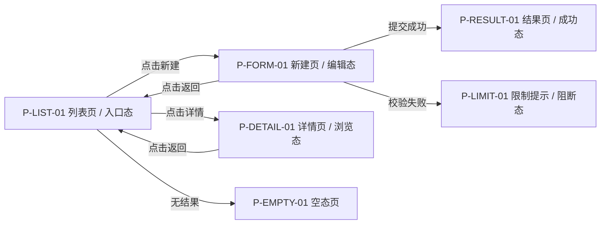
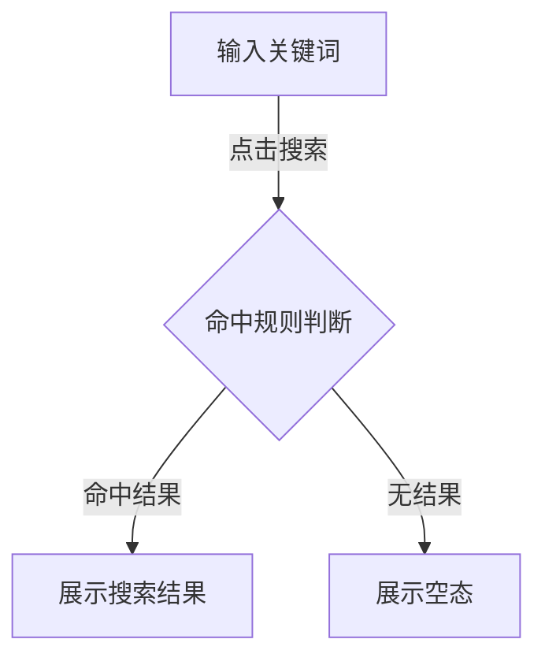
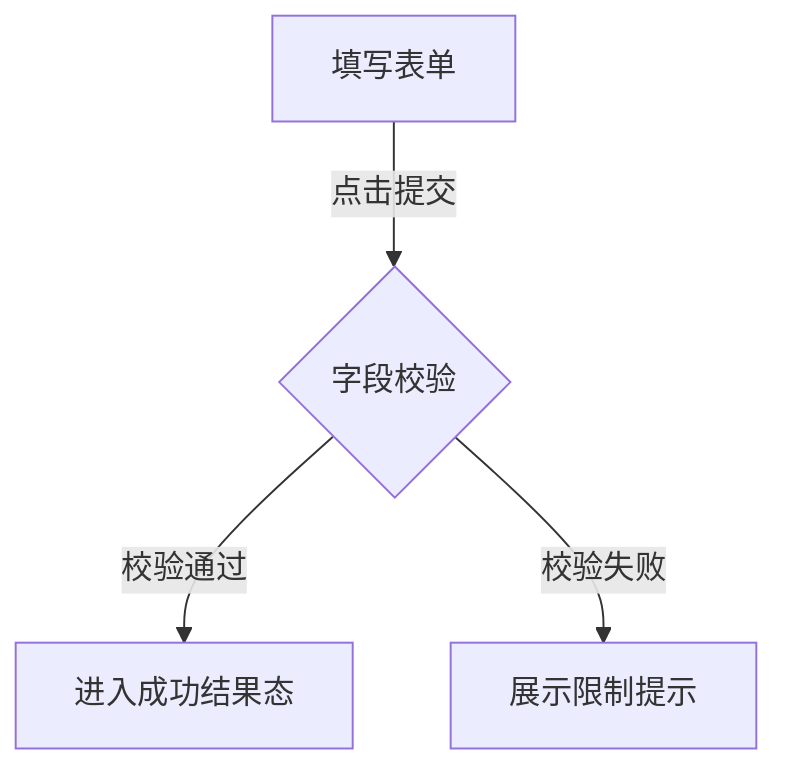

# 模块流程图与人类确认

## 1. 文档信息

- 文档名称：模块流程图与人类确认
- 适用模块：`<模块名>`
- 适用阶段：原型前准入 / 人类阅读收口
- 文档定位：正式下游文件

## 2. 使用边界与分类口径

- 模块 `PRD` 真源固定为 `01-模块执行包/<模块名>/01-PRD/01-模块PRD.md`。
- 本文件是正式下游文件，不是第二套模块真源。
- `80-完整提交包/` 只做阅读入口，不得反向充当模块真源。
- `功能规则精炼卡` 只做关键规则核对与真源回链，不重写 `4.2 / 4.2A / 4.3 / 4.4 / 7` 的正式规则正文。

## 3. 面向原型的页面流转流程图

- 页面编号：P-LIST-01
- 页面名称：列表页
- 终端类型：手机端 / PC端 / 管理后台 / 通用
- 当前态角色：游客 / 已登录用户 / 审核员
- 关键分支：进入详情、命中限制、无结果回流
- 返回路径：详情页返回列表页；表单页取消返回列表页
- 成功出口：列表页 -> 详情页 -> 成功结果页
- 失败 / 限制 / 空态出口：空态页、限制提示、失败结果页

## 4. 面向 `PRD` 的功能型点击流程图

### 4.1 搜索功能型点击流程图

### 4.2 提交功能型点击流程图

## 5. 功能规则精炼卡

### 5.1 搜索功能规则精炼卡

- `功能动作`：搜索
- `规则点清单`：
  - 关键词为空时不给请求
  - 命中后进入结果态或空态
- `每个规则点的真源锚点`：
  - 关键词为空时不给请求 -> `01-模块执行包/<模块名>/01-PRD/01-模块PRD.md#4.2-search-empty-keyword`
  - 命中后进入结果态或空态 -> `01-模块执行包/<模块名>/01-PRD/01-模块PRD.md#4.2-search-result-routing`
- `缺口说明`：搜索无结果文案、弱网降级提示仍待冻结
- `缺口影响`：若文案或降级规则未冻结，原型评审对空态与失败态的判断会失真
- `相关页面状态 / 结果状态`：结果态、空态、弱网失败提示态
- `是否需要后台 / 他角色承接`：需要后台搜索接口
- 规则核对说明：本卡只核对搜索动作对应的规则点与真源锚点，不在此重写 `PRD` 正文。
- `真源回链`：`01-模块执行包/<模块名>/01-PRD/01-模块PRD.md#4.2`

### 5.2 提交功能规则精炼卡

- `功能动作`：提交
- `规则点清单`：
  - 字段校验通过后才能提交
  - 校验失败时停留当前页并提示
- `每个规则点的真源锚点`：
  - 字段校验通过后才能提交 -> `01-模块执行包/<模块名>/01-PRD/01-模块PRD.md#4.2A-submit-validation-pass`
  - 校验失败时停留当前页并提示 -> `01-模块执行包/<模块名>/01-PRD/01-模块PRD.md#4.2A-submit-validation-block`
- `缺口说明`：提交接口超时后的补偿提示仍待确认
- `缺口影响`：若补偿提示未冻结，成功态与挂起态的 prototype 承接会不一致
- `相关页面状态 / 结果状态`：成功结果态、限制提示态、挂起提示态
- `是否需要后台 / 他角色承接`：需要后台创建接口
- 规则核对说明：本卡只核对提交动作对应的规则点与真源锚点，不在此重写 `PRD` 正文。
- `真源回链`：`01-模块执行包/<模块名>/01-PRD/01-模块PRD.md#4.2A`

## 6. 面向 `PRD` 的纯交互点击流程图

### 6.1 Tab 切换纯交互点击流程图

## 7. 人类确认

### 7.1 原型前总控准入

- 原型前总控必须确认本文件已落盘、已回链模块 `PRD` 真源，且页面流转、功能型点击流程图、纯交互点击流程图内容已足够支撑进入原型链。
- 若本文件缺失、未回链或只剩阅读层摘要，总控不得放行原型执行。
- 本文件不得替代正式 `PRD`。
- 本文件不得替代 `4.3 页面合同清单`。
- 本文件不得替代 `4.4 结构化契约字段清单`。

### 7.2 产品审查质量兜底

- 产品审查必须在原型执行前完成，且结论已回收到总控；缺少产品审查回执或结论，不得进入 `11 / 13 / 14`。
- 产品审查只核对 `4.X` 与 `5.X` 是否一一对应、关键规则是否可被人理解、回链是否指向 `PRD` 真源，不在本文件里重写 `PRD` 正文规则。
- 本文件不得替代 `21-审查-产品审查` 回执或结论。

## 8. 真源回链与模块级待判断问题

| 字段 | 填写内容 |
|------|------|
| canonical backlink | `01-模块执行包/<模块名>/01-PRD/01-模块PRD.md` |
| linked_prd_source | `01-模块执行包/<模块名>/01-PRD/01-模块PRD.md` |

- `canonical backlink` 与 `linked_prd_source` 都必须回到当前模块 `PRD` 真源。
- `linked_prd_source` 不得指向 `80-完整提交包/` 展示层。

| 模块级待判断问题 | 是否需要研发/跨团队参与 | 来源真源链接 | 来源条款/位置 |
|------|------|------|------|
| 高风险规则是否仍有未冻结值 | `是 / 否` | | |
| 页面流转是否仍存在未覆盖出口 | `是 / 否` | | |

- 纯产品内部细节不上研发宣讲会；只有需要研发或跨团队参与判断的问题才保留在本表。
