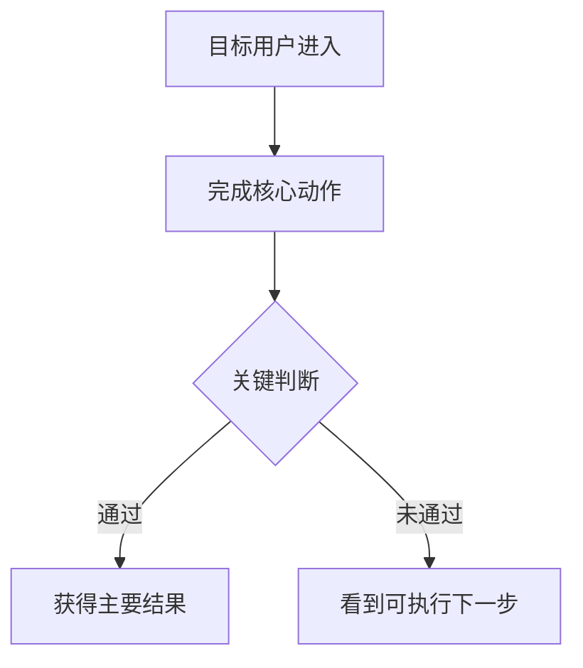
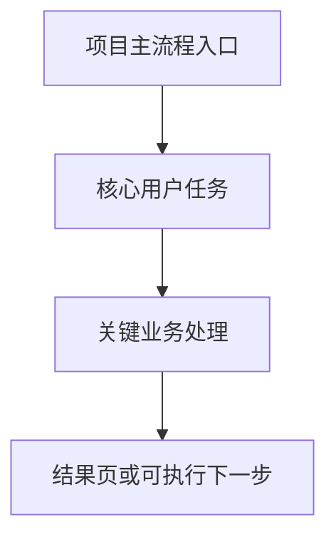
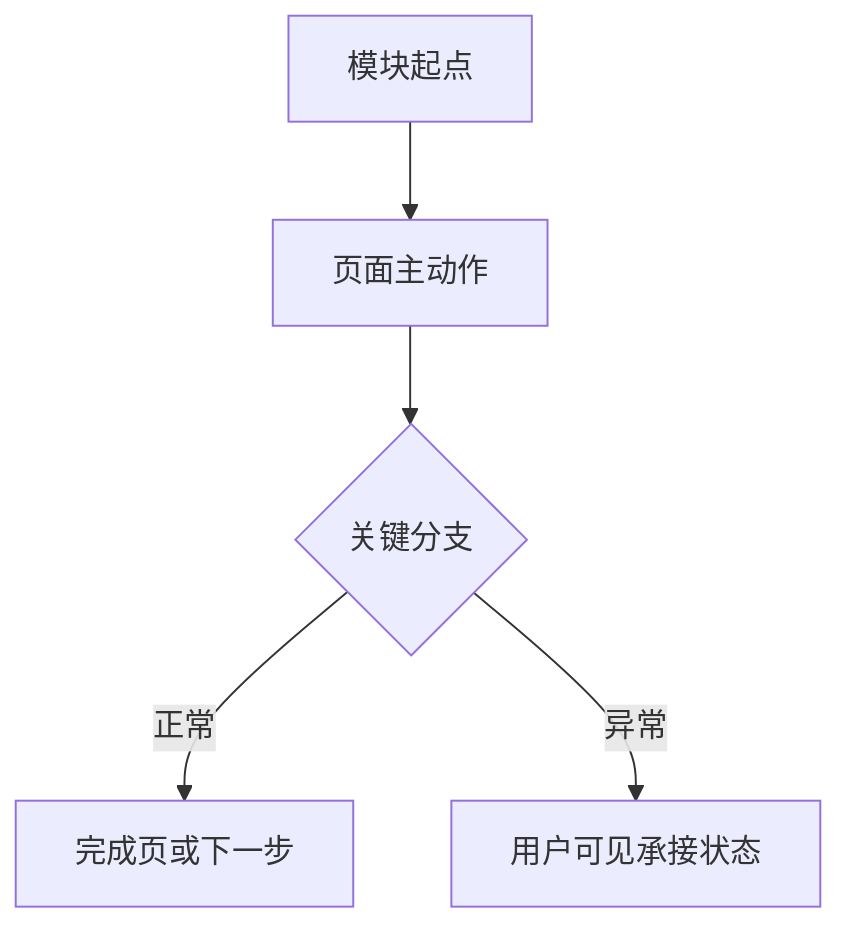

# PRD阅读层（合并PRD）

本页只负责阅读层展示，不承担 canonical truth 职责。

## 首屏核心说明

| 字段 | 填写内容 | 来源真源链接 | 来源条款/位置 |
|------|------|------|------|
| 项目主要做什么 | | | |
| 项目明确不做什么 | | | |
| 用户角色和权限 | | | |
| 主用户旅程一句话 | | | |

## 人读流程图速查

- [项目整体业务闭环图](#项目整体业务闭环图)
- [模块关系图](#模块关系图)
- [分模块主流程图](#分模块主流程图)

## 主用户旅程图

## 项目整体业务闭环图

## 模块关系图

## 分模块主流程图

## 命名边界

- 标题必须显式包含“阅读层”
- 不得写成“唯一正式合并 PRD”
- 不能反向作为模块或功能的真源
