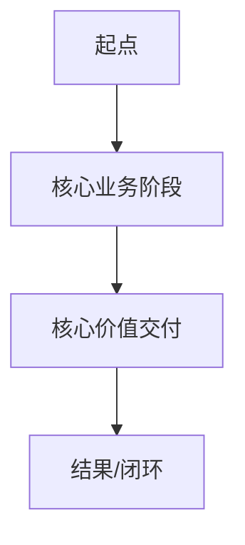
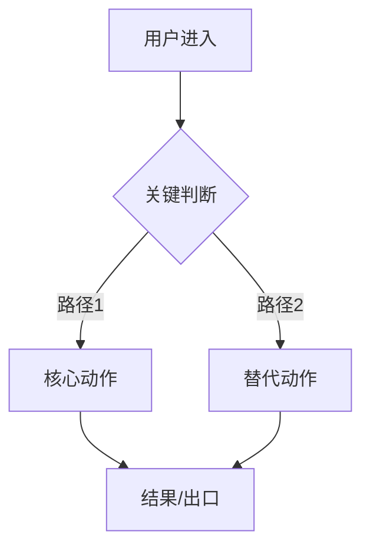
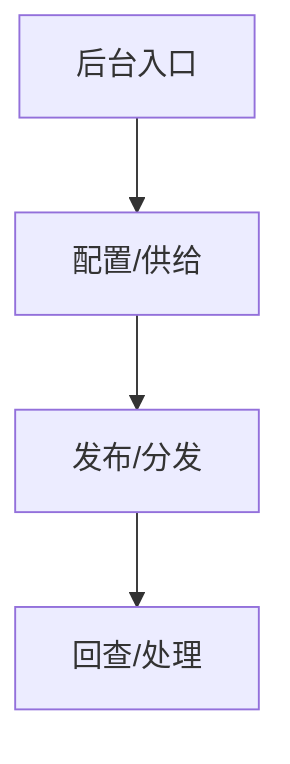
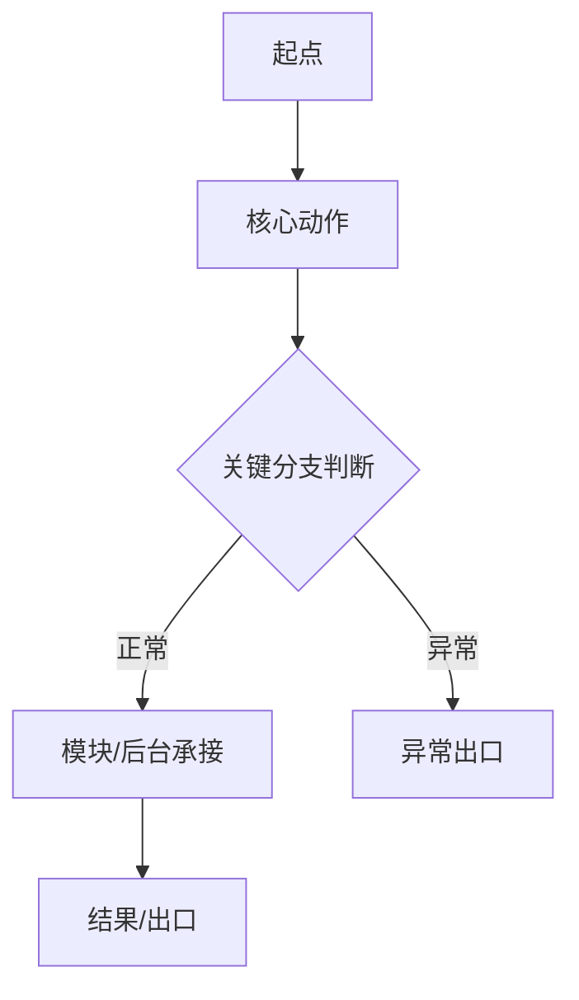

# PRD阅读层模板（合并PRD）

| 项目 | 内容 |
|------|------|
| 文档角色 | 合并PRD 阅读层模板 |
| 文档状态 | `正式条款版 v1` |
| 所属目录 | `install/default_bundle/assets/templates/` |
| 适用范围 | `80-完整提交包/01-合并PRD/` 的人类阅读层 |
| 更新时间 | `2026-04-05` |

## 1. 模板用途

- 本模板用于组织级 `合并 PRD` 阅读层，不替代模块级 `PRD` 真源。
- 本模板优先解决“给人快速看懂整包业务”的问题，而不是重复结构化正文。
- 正式口径固定为：图给人看，结构化文字给 AI 和执行链看。
- 若项目已启用完整提交阅读层，默认目标文件固定为 `80-完整提交包/01-合并PRD/01-合并PRD阅读层.md`，并由 `00-PRD索引.md` 作为 `PRD阅读入口` 回链。

## 2. 使用边界

- 本模板只用于 `80-完整提交包/01-合并PRD/`。
- 模块级 `PRD` 继续承担正式真源职责。
- 阅读层不是 canonical truth，不能反向作为模块或功能的真源。
- 合并 `PRD` 不复制各模块正文，不重写字段表、规则表、验收表。
- 合并 `PRD` 只保留最少文字、最强图示、最清晰回链。
- 生产责任默认归属 `产品经理` 或 `总控指定的整包汇总责任人`。
- 启用条件固定为：`已启用完整提交阅读层`。
- 若已启用完整提交阅读层但缺少目标文件，应判为补料，不得宣称阅读层已完成。
- 标题必须显式包含“阅读层”，不得写成“唯一正式合并 PRD”或其他会让人误判为 canonical truth 的口径。
- 首屏主命名固定为：索引页叫 `PRD阅读入口`，正文页叫 `PRD阅读层`。

## 3. 阅读层模板

### 3.1 文档信息

| 字段 | 填写内容 |
|------|------|
| 文档标题 | |
| 版本号 | |
| 文档状态 | |
| 建议目标文件 | `80-完整提交包/01-合并PRD/01-合并PRD阅读层.md` |
| 生产责任 | `产品经理 / 总控指定汇总责任人` |
| 启用条件 | `已启用完整提交阅读层` |
| 缺失处理 | `已启用完整提交阅读层但缺目标文件时，判补料` |
| 负责人 | |
| 更新时间 | |

### 3.2 阅读定位

| 字段 | 填写内容 | 来源真源链接 | 来源条款/位置 |
|------|------|------|------|
| 给谁看 | | | |
| 要解决什么阅读问题 | | | |
| 不替代哪些真源 | | | |

### 3.3 真源回链

| 分类 | 链接 | 来源条款/位置 |
|------|------|------|
| 项目级基线 | 1.  2. | |
| active 模块真源 | 1. `01-模块执行包/<模块名>/01-PRD/01-模块PRD.md` | |
| 模块 supporting docs | 1. `01-模块执行包/<模块名>/01-PRD/02-模块流程图与人类确认.md` | |
| deferred 里程碑 | 1.  2. | |

- `00-PRD索引.md` 是 `PRD阅读入口`；阅读层正文首屏必须补一个 `人读流程图速查`，集中列出模块图、状态图、泳道图等给人看的图示入口，并必须包含实际 Mermaid 或等价流程图，不能只写待补说明、文字箭头串或回链免责声明。

#### 人读流程图速查

- [项目整体业务闭环图](#34-项目整体业务闭环图)
- [模块关系图](#35-模块关系图)
- [C端主旅程图](#36-c端主旅程图)
- [后台支撑旅程图](#37-后台支撑旅程图)
- [模块流程图与人类确认](../../01-模块执行包/<模块名>/01-PRD/02-模块流程图与人类确认.md)
- [分模块主流程图](#39-分模块主流程图)

### 3.4 项目整体业务闭环图

| 字段 | 填写内容 |
|------|------|
| 图示目标 | |
| 来源真源链接 | |
| 来源条款/位置 | |

### 3.5 模块关系图

| 字段 | 填写内容 |
|------|------|
| 图示目标 | |
| 来源真源链接 | |
| 来源条款/位置 | |

### 3.6 C端主旅程图

| 字段 | 填写内容 |
|------|------|
| 图示目标 | |
| 来源真源链接 | |
| 来源条款/位置 | |

### 3.7 后台支撑旅程图

| 字段 | 填写内容 |
|------|------|
| 图示目标 | |
| 来源真源链接 | |
| 来源条款/位置 | |

### 3.8 Active 模块总览

| 模块名称 | 模块目标一句话 | 关键输入/输出一句话 | 真源PRD链接 | 来源条款/位置 |
|------|------|------|------|------|
|  |  |  |  |  |

### 3.9 分模块主流程图

#### 模块名称

| 字段 | 填写内容 |
|------|------|
| 适用角色/主体 | |
| 模块目标 | |
| 真源PRD链接 | |
| 来源条款/位置 | |

### 3.10 风险与待确认

| 风险/待确认项 | 与当前阅读层的关系 | 来源真源链接 | 来源条款/位置 |
|------|------|------|------|
|  |  |  |  |

### 3.11 deferred 里程碑

| deferred 事项 | 与当前范围关系 | 对应真源链接 | 来源条款/位置 |
|------|------|------|------|
|  |  |  |  |

## 4. 图示规范

- `V1` 统一优先使用 `Mermaid`。
- 每张图只表达一个层级，不混写业务规则、页面细节和技术路径。
- 每张图至少包含：
  - 起点
  - 角色/主体
  - 核心动作节点
  - 关键分支判断
  - 模块或后台承接节点
  - 结果/出口
- 图中节点命名优先使用业务语言，不使用接口名、表名、技术组件名。
- 图中不写字段、阈值、接口定义、存储方案或实现路径。
- 禁止把阻断、异常、回跳、兜底类结果节点写成抽象口号；若图中出现 `限制进入核心能力 / 回来源页 / 异常处理 / 失败兜底`，至少要同时写清用户可见承接页或承接状态，以及允许出口或可执行下一步。

## 5. 填写要求

- 合并 `PRD` 是人类阅读层，不是模块真源层。
- 阅读层不是 canonical truth；它只负责帮助人理解业务闭环与模块关系。
- 每个模块只保留极少文字：
  - 模块目标一句话
  - 关键输入/输出一句话
  - 真源 `PRD` 链接
- 解释性文字默认不超过 `3` 句；超过时应改成流程图、真源回链或删除。
- `3.2 阅读定位`、`3.3 真源回链`、`3.4-3.7` 图示区都必须填写来源真源链接与来源条款/位置，不能只写阅读层自己的概括。
- `3.8 Active 模块总览`、`3.9 分模块主流程图`、`3.10 风险与待确认`、`3.11 deferred 里程碑` 都必须填写来源条款/位置。
- `3.10 风险与待确认` 与 `3.11 deferred 里程碑` 只做关系说明与链接回链，不展开正文，不得写成独立状态面板。
- 若需要展开字段、规则、验收、页面合同、结构化契约字段，应回到对应模块真源。
- 若需要查看模块级页面流转、点击流、规则卡核对与人类确认，应回到 `01-模块执行包/<模块名>/01-PRD/02-模块流程图与人类确认.md`。
- 合并 `PRD` 可以帮助人快速理解全局，但不得反向覆盖模块 `PRD` 正文。
- 阅读层标题必须显式包含“阅读层”，不得写成“唯一正式合并 PRD”。
- 若存在模块级给人看的流程图、状态图、泳道图，阅读层正文必须提供 `人读流程图速查`，不得只在正文里留下“请自行去模块目录查找”的免责声明。
- 合并 `PRD` 中的项目级图或模块级摘要图只改善可读性，不能替代 trigger-required 的模块级流程图、状态图、泳道图或工程交接清单。
